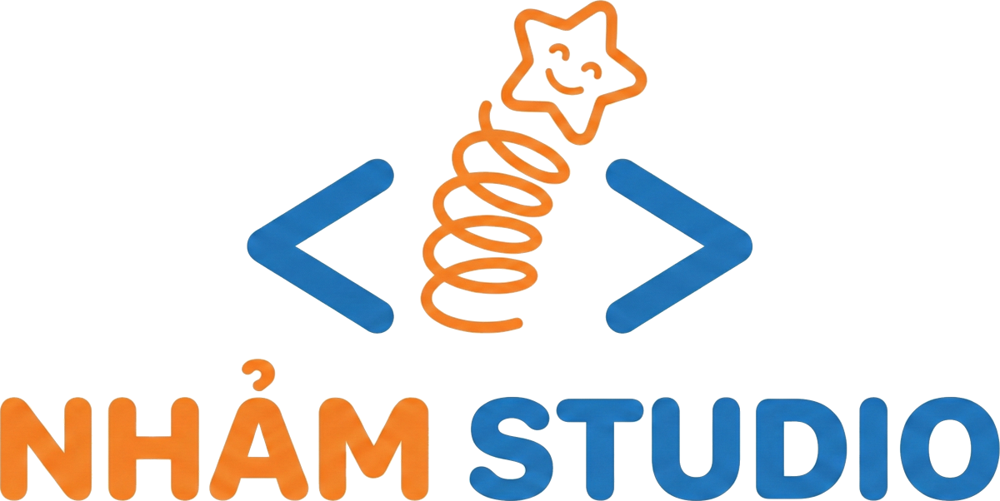

<p align="center">
  
</p>

<h1 align="center">
   Vẽ lại cho đẹp
</h1>

<p align="center">
  Biến ảnh chụp <b>sơ đồ vẽ tay</b>, <b>bảng biểu nguệch ngoạc</b> hay <b>ghi chép viết tay</b>
  thành bản trình bày gọn gàng, chuyên nghiệp — xuất ra <b>ảnh PNG</b>, <b>PDF</b> hoặc <b>tệp văn bản</b>.
</p>

<p align="center">
  <a href="../../releases/latest"><b>⬇️ Tải bản mới nhất (Windows .exe / Android .apk)</b></a>
  &nbsp;·&nbsp; Phát triển bởi <a href="https://topvl.net"><b>NhamStudio</b></a>
</p>

---

## Tính năng

| Đầu vào (ảnh) | Ứng dụng làm gì | Đầu ra |
|---|---|---|
| Lưu đồ, sơ đồ quy trình, mind map, sơ đồ tổ chức… vẽ tay | Nhận diện các khối, mũi tên, nhãn rồi **vẽ lại** bằng hình chuẩn, bố cục thẳng hàng, màu sắc hài hoà | PNG, PDF, SVG |
| Bảng kẻ tay / ảnh chụp bảng trình bày xấu | Trích xuất đầy đủ hàng–cột, **dựng lại bảng** có tiêu đề, kẻ viền, tô màu xen kẽ | PNG, PDF, CSV (mở bằng Excel) |
| Chữ viết tay, ghi chép, thư từ | **Chép lại thành văn bản** giữ nguyên tiếng Việt có dấu, tiêu đề, gạch đầu dòng; sửa được trực tiếp | TXT, PDF, PNG |

- **Tự nhận diện** loại nội dung, hoặc tự chọn: Sơ đồ / Bảng / Văn bản.
- **So sánh** bản đẹp với ảnh gốc chỉ bằng một chạm.
- **Chỉnh sửa bằng lời**: “đổi bố cục sang ngang”, “thêm cột Ghi chú”, “tô xanh bước kết thúc”… rồi bấm *Vẽ lại theo yêu cầu*.
- **Phong cách mặc định** tuỳ chỉnh trong Cài đặt (màu sắc, hướng bố cục…).
- PDF nhúng font **Be Vietnam Pro** nên hiển thị tiếng Việt chuẩn trên mọi máy.
- Chạy trên **Windows** (bản cài đặt `.exe` hoặc bản portable `.zip`) và **Android** (`.apk`; chụp ảnh trực tiếp từ camera).

## Cài đặt & sử dụng

1. Tải về từ trang [Releases](../../releases/latest):
   - Windows: `VeLaiChoDep-Setup-x.y.z.exe` (cài đặt) hoặc `VeLaiChoDep-x.y.z-windows-portable.zip` (giải nén rồi chạy `VeLaiChoDep.exe`).
   - Android: `VeLaiChoDep-x.y.z.apk` (cho phép “Cài ứng dụng không rõ nguồn gốc” khi được hỏi).
2. Mở ứng dụng → **Cài đặt** → chọn **nhà cung cấp AI**, nhập **API key** và **model** (xem bảng bên dưới).
   Key chỉ lưu trên máy của bạn và được gửi thẳng tới máy chủ của nhà cung cấp.
3. Chọn / chụp ảnh → bấm **Vẽ lại cho đẹp** → xem kết quả → **Lưu** hoặc **Chia sẻ**.

### Nhà cung cấp AI

| Nhà cung cấp | Cần nhập | Model mặc định | Lấy API key |
|---|---|---|---|
| **Anthropic Claude** | API key, model | `claude-opus-5-5` | [console.anthropic.com](https://console.anthropic.com/settings/keys) |
| **Google Gemini** | API key, model | `gemini-pro-latest` | [aistudio.google.com](https://aistudio.google.com/apikey) |
| **OpenAI** | API key, model | `gpt-5` | [platform.openai.com](https://platform.openai.com/api-keys) |
| **Custom API** (tương thích OpenAI) | **Base URL**, API key (tuỳ chọn), model | — | OpenRouter, DeepSeek, Groq, Ollama, LM Studio, vLLM… |

- **Model nhập tự do**: gõ tên model bất kỳ, chọn nhanh từ gợi ý, hoặc bấm biểu tượng danh sách để **tải danh sách model thật** từ máy chủ.
- **Kiểm tra kết nối** ngay trong Cài đặt.
- Custom API gọi `<Base URL>/chat/completions`, ví dụ `https://openrouter.ai/api/v1` hoặc `http://localhost:11434/v1` (Ollama). Model phải hỗ trợ đọc ảnh (vision).
- Ứng dụng ưu tiên chế độ JSON có schema chặt chẽ; nếu model/máy chủ không hỗ trợ (HTTP 400), tự động thử lại với cấu hình đơn giản hơn.
- Chi phí gọi API tính theo tài khoản của bạn ở nhà cung cấp tương ứng.

## Cách hoạt động

```
Ảnh ──► thu nhỏ/chuẩn hoá (≤ 2400px, JPEG) ──► Claude / Gemini / OpenAI / Custom (vision + JSON)
                                                     │
                     ┌───────────────────────────────┼───────────────────────────────┐
                 kind=diagram                    kind=table                      kind=text
                 SVG vẽ lại                      headers + rows                  văn bản (markdown nhẹ)
                     │                               │                               │
              flutter_svg → PNG                Bảng Flutter → PNG             Trang văn bản → PNG
              PNG → PDF, SVG                   Bảng PDF, CSV                  PDF, TXT
```

Mã nguồn chính:

| Tệp | Vai trò |
|---|---|
| `lib/services/ai/ai_service.dart` | Giao diện chung + cơ chế thử lại với cấu hình đơn giản hơn |
| `lib/services/ai/anthropic_service.dart` | Anthropic Messages API (streaming, JSON schema, refusal, server-side fallback) |
| `lib/services/ai/gemini_service.dart` | Google Gemini `streamGenerateContent` |
| `lib/services/ai/openai_service.dart` | OpenAI và mọi API tương thích OpenAI (`/chat/completions`) |
| `lib/services/ai/ai_common.dart` | Prompt, JSON schema, xử lý ảnh, đọc SSE, thông báo lỗi |
| `lib/services/export_service.dart` | Tạo PNG / PDF / TXT / CSV, lưu & chia sẻ tệp |
| `lib/screens/` | Màn hình Trang chính, Kết quả, Cài đặt, Giới thiệu |
| `lib/widgets/result_views.dart` | Hiển thị sơ đồ, bảng, văn bản |
| `assets/icon/app_icon.svg` | Icon ứng dụng (nguồn vector) |

## Build từ mã nguồn

Yêu cầu: [Flutter](https://docs.flutter.dev/get-started/install) 3.47+ (stable).

```bash
flutter pub get
flutter test

# Android APK (cần Android SDK + JDK 17)
flutter build apk --release
#   → build/app/outputs/flutter-apk/app-release.apk

# Windows EXE (chạy trên Windows, cần Visual Studio 2022 "Desktop development with C++")
flutter build windows --release
#   → build/windows/x64/runner/Release/VeLaiChoDep.exe
```

Tạo lại icon sau khi sửa `assets/icon/app_icon.png`:

```bash
dart run flutter_launcher_icons
```

## Build & phát hành tự động (GitHub Actions)

Workflow [`.github/workflows/build-release.yml`](.github/workflows/build-release.yml):

- **Mọi lần push / pull request**: chạy `flutter analyze`, `flutter test`, build APK Android và bản Windows (tải về ở mục *Artifacts* của lần chạy).
- **Push vào `main`** (hoặc tag `v*`): tạo/cập nhật **GitHub Release** `v<version>` (lấy từ `version:` trong `pubspec.yaml`) kèm:
  - `VeLaiChoDep-<version>.apk`
  - `VeLaiChoDep-Setup-<version>.exe` (bộ cài Inno Setup)
  - `VeLaiChoDep-<version>-windows-portable.zip`

Muốn ra phiên bản mới: tăng `version:` trong `pubspec.yaml` rồi merge vào `main`.

### Ký APK bằng keystore riêng (khuyến nghị)

Nếu không cấu hình, APK được ký bằng debug key (vẫn cài được, nhưng không nên dùng để phát hành lâu dài).
Thêm các *repository secrets* sau (Settings → Secrets and variables → Actions):

| Secret | Giá trị |
|---|---|
| `ANDROID_KEYSTORE_BASE64` | `base64 -w0 release.jks` |
| `ANDROID_KEYSTORE_PASSWORD` | Mật khẩu keystore |
| `ANDROID_KEY_ALIAS` | Alias của key |
| `ANDROID_KEY_PASSWORD` | Mật khẩu key |

Tạo keystore: `keytool -genkey -v -keystore release.jks -keyalg RSA -keysize 2048 -validity 10000 -alias velaichodep`

## Thông tin

- **Ứng dụng:** Vẽ lại cho đẹp
- **Nhà phát triển:** NhamStudio
- **Website:** [https://topvl.net](https://topvl.net)
- Font chữ: [Be Vietnam Pro](https://github.com/bettergui/BeVietnamPro) — SIL Open Font License 1.1 (`assets/fonts/OFL.txt`).

<p align="center"></p>
